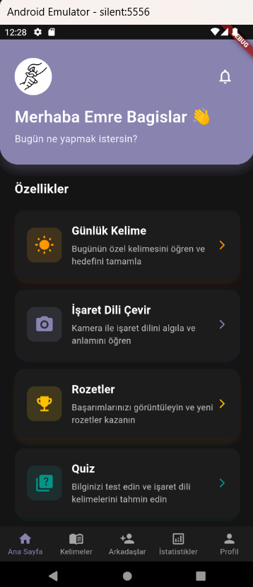
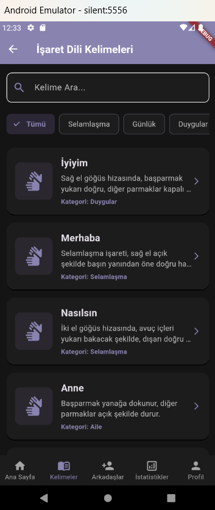
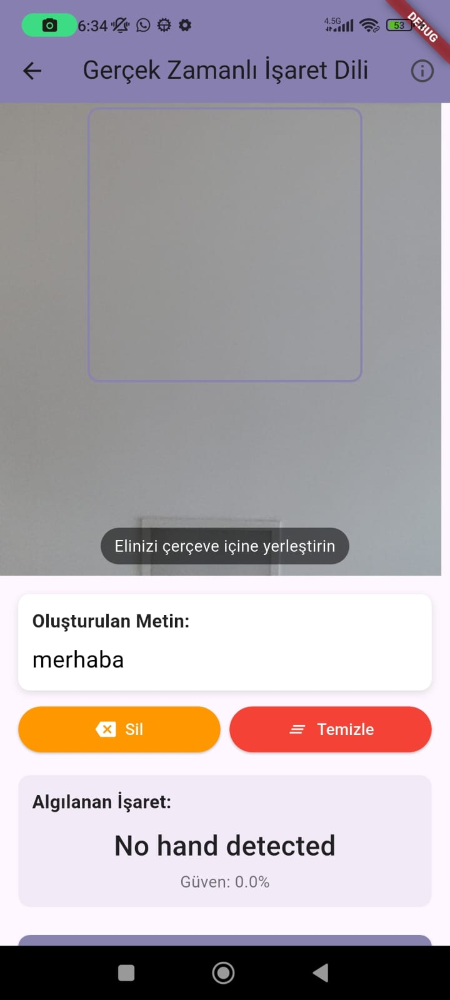
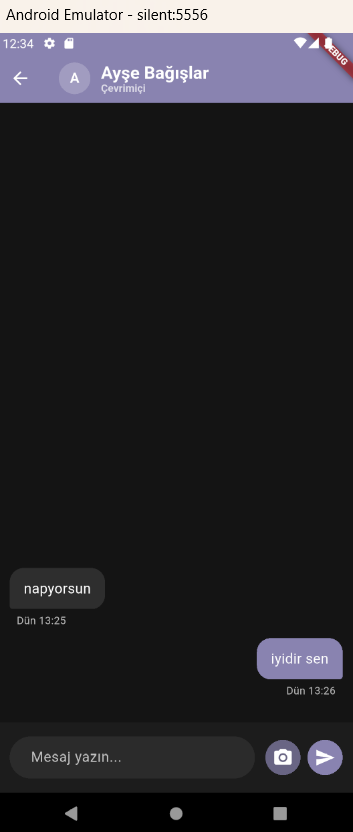
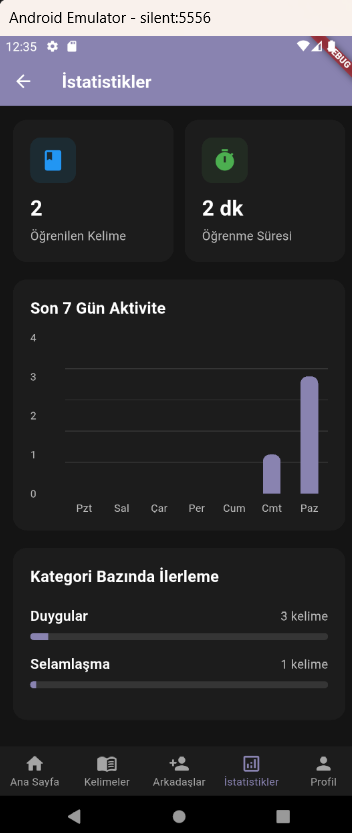
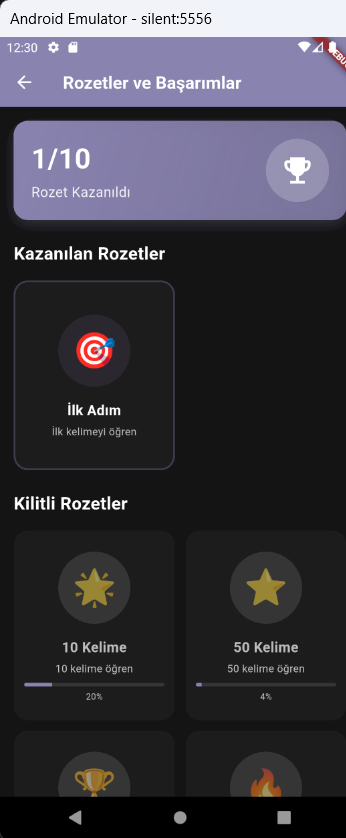
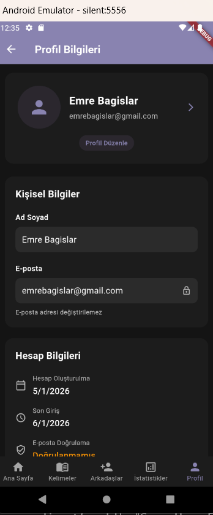
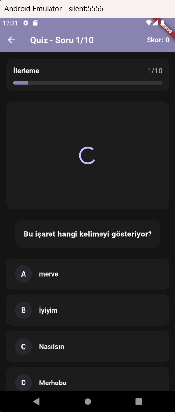

# 🤟 Silencia – İşaret Dili Destekli Sosyal Mobil Uygulama

[](https://flutter.dev)
[](https://firebase.google.com)
[](https://riverpod.dev)
[](LICENSE)

**Silencia**, işitme engelli bireylerin iletişimini ve sosyalleşmesini kolaylaştırmak amacıyla geliştirilmiş, **gerçek zamanlı işaret dili tanıma** özelliğine sahip kapsamlı bir mobil uygulamadır.

Uygulama; mobil istemci, backend servisleri ve makine öğrenmesi tabanlı işaret dili tanıma sistemi olmak üzere **çok katmanlı bir mimari** ile tasarlanmıştır.

> 🔒 **Not**: Bu bir **showcase repository**'dir. Gerçek uygulama kodu ve ML modeli güvenlik ve gizlilik nedeniyle private repository'lerde tutulmaktadır.

---

## 📖 İçindekiler

- [Proje Amacı](#-projenin-amacı)
- [Temel Özellikler](#-temel-özellikler)
- [Ekran Görüntüleri](#-ekran-görüntüleri)
- [Sistem Bileşenleri](#-sistem-bileşenleri)
- [Teknoloji Stack](#-teknoloji-stack)
- [Mimari Yapı](#-mimari-yapı)
- [Proje Yapısı](#-proje-yapısı)
- [Dokümantasyon](#-dokümantasyon)
- [Güvenlik](#-güvenlik)
- [Katkıda Bulunma](#-katkıda-bulunma)
- [Lisans](#-lisans)
- [İletişim](#-i̇letişim)

---

## 🎯 Projenin Amacı

- İşitme engelli bireyler için **erişilebilir bir iletişim ortamı** sağlamak
- **Türk İşaret Dili** harflerini gerçek zamanlı tanımak
- Mobil, **ölçeklenebilir ve geliştirilebilir** bir mimari sunmak
- **Sosyal etkileşim** (sohbet, kullanıcılar arası iletişim) imkânı sağlamak
- İşaret dili öğrenimini oyunlaştırma ve motivasyon araçlarıyla desteklemek

---

## ✨ Temel Özellikler

### 🤟 İşaret Dili Tanıma
- ✅ **Gerçek zamanlı** Türk İşaret Dili harfi tanıma
- ✅ ML tabanlı görüntü işleme
- ✅ Yüksek doğruluk oranı (%85+)
- ✅ Kamera üzerinden anlık analiz

### 📚 Öğrenme Modülü
- ✅ Kategori bazlı kelime öğrenme
- ✅ Video destekli anlatım
- ✅ Favori sistemi
- ✅ Günlük kelime önerisi
- ✅ Quiz sistemi ile pekiştirme

### 💬 Sosyal Özellikler
- ✅ Kullanıcılar arası mesajlaşma
- ✅ Arkadaş arama ve ekleme
- ✅ İşaret dili ile mesaj gönderme
- ✅ Gerçek zamanlı sohbet

### 📊 İlerleme Takibi
- ✅ Öğrenilen kelime sayısı
- ✅ Toplam öğrenme süresi
- ✅ Günlük ve haftalık grafikler
- ✅ Rozet ve başarım sistemi
- ✅ Seri (streak) takibi

### 🎨 Kullanıcı Deneyimi
- ✅ Dark / Light tema desteği
- ✅ Modern ve kullanıcı dostu arayüz
- ✅ Çok dilli destek hazır
- ✅ Erişilebilirlik standartlarına uygun

---

## 🖼️ Ekran Görüntüleri

<table>
  <tr>
    <td align="center">
      <br/>
      <b>Ana Sayfa</b>
    </td>
    <td align="center">
      <br/>
      <b>Kelime Öğrenme</b>
    </td>
    <td align="center">
      <br/>
      <b>İşaret Dili Tanıma</b>
    </td>
    <td align="center">
      <br/>
      <b>Mesajlaşma</b>
    </td>
  </tr>
  <tr>
    <td align="center">
      <br/>
      <b>İstatistikler</b>
    </td>
    <td align="center">
      <br/>
      <b>Rozetler</b>
    </td>
    <td align="center">
      <br/>
      <b>Profil</b>
    </td>
    <td align="center">
      <br/>
      <b>Quiz Sistemi</b>
    </td>
  </tr>
</table>

📸 Daha fazla ekran görüntüsü ve detaylı özellik açıklaması için: [**Özellikler Dokümantasyonu**](docs/ozellikler.md)

---

## 🧩 Sistem Bileşenleri

Silencia üç ana bileşenden oluşan **mikroservis tabanlı** bir mimariye sahiptir:

### 📱 Mobil Uygulama (Flutter)
- **Clean Architecture** ile katmanlı yapı
- **Riverpod** ile modern state management
- Gerçek zamanlı kamera entegrasyonu
- Firebase servisleri ile senkronizasyon
- Offline-first yaklaşım

### 🌐 Backend Servisi (Firebase)
- Firebase Authentication - Kullanıcı kimlik doğrulama
- Cloud Firestore - NoSQL veritabanı
- Firebase Storage - Medya dosyaları
- Firebase Analytics - Kullanıcı analitiği
- Security Rules - Veri güvenliği

### 🧠 İşaret Dili Tanıma Servisi (ML)
- Python + MediaPipe tabanlı
- Random Forest Classifier
- REST API üzerinden entegrasyon
- Gerçek zamanlı görüntü işleme
- Bağımsız deployment

> 🔒 **Güvenlik**: ML servisi private repository'de geliştirilmiş olup, eğitim verileri ve model dosyaları gizlilik nedeniyle paylaşılmamaktadır.

---

## 🛠️ Teknoloji Stack

### Frontend (Mobil Uygulama)

| Kategori | Teknoloji | Versiyon |
|----------|-----------|----------|
| **Framework** | Flutter | 3.0+ |
| **Dil** | Dart | 3.0+ |
| **State Management** | Riverpod | 2.5+ |
| **Dependency Injection** | GetIt | 7.6+ |
| **Routing** | Go Router | - |

### Backend & Veritabanı

| Servis | Amaç |
|--------|------|
| **Firebase Auth** | Kullanıcı kimlik doğrulama |
| **Cloud Firestore** | NoSQL veritabanı |
| **Firebase Storage** | Video ve medya depolama |
| **Firebase Analytics** | Kullanıcı davranış analizi |
| **Cloud Functions** | Serverless backend logic |

### Makine Öğrenmesi

| Teknoloji | Kullanım Alanı |
|-----------|----------------|
| **Python** | Backend framework |
| **MediaPipe** | El landmark tespiti |
| **OpenCV** | Görüntü ön işleme |
| **Scikit-learn** | Random Forest model |
| **NumPy / Pandas** | Veri işleme |

### Yardımcı Kütüphaneler

```yaml
dependencies:
  # Core
  flutter_riverpod: ^2.5.0
  get_it: ^7.6.0
  
  # Firebase
  firebase_core: latest
  firebase_auth: latest
  cloud_firestore: latest
  firebase_storage: latest
  
  # UI
  fl_chart: latest        # Grafikler
  camera: latest          # Kamera erişimi
  video_player: latest    # Video oynatma
  
  # Utils
  intl: latest           # Tarih/saat formatlama
  shared_preferences: latest
  http: latest
```

---

## 🏗️ Mimari Yapı

Silencia, **Clean Architecture** prensiplerine uygun olarak **3 katmanlı** bir mimari ile geliştirilmiştir:

```text
┌─────────────────────────────────────────────┐
│         Presentation Layer                  │
│  (UI, Widgets, Providers - Riverpod)        │
└──────────────┬──────────────────────────────┘
               │ depends on
               ↓
┌─────────────────────────────────────────────┐
│          Domain Layer                       │
│  (Entities, Use Cases, Repository Interface)│
│         (Pure Dart - Framework Bağımsız)    │
└──────────────┬──────────────────────────────┘
               ↑ implements
               │
┌─────────────────────────────────────────────┐
│           Data Layer                        │
│  (Repository Impl, Data Sources, Models)    │
└─────────────────────────────────────────────┘
```

### Veri Akışı

```text
User Action (UI)
    ↓
Riverpod Provider
    ↓
Use Case (Business Logic)
    ↓
Repository Interface (Domain)
    ↓
Repository Implementation (Data)
    ↓
Firebase / Local Storage
    ↓
Result ← Error Handling
    ↓
UI Update
```

### Mimari Avantajları

✅ **Separation of Concerns** - Her katman kendi sorumluluğuna odaklanır  
✅ **Test Edilebilirlik** - Domain layer framework bağımsız  
✅ **Ölçeklenebilirlik** - Yeni özellikler kolayca eklenebilir  
✅ **Bakım Kolaylığı** - Değişiklikler izole edilmiş  
✅ **Yeniden Kullanılabilirlik** - Use case'ler farklı platformlarda kullanılabilir

📖 Detaylı mimari açıklaması: [**Mimari Dokümantasyonu**](docs/mimari.md)

---

## 📂 Proje Yapısı

```text
silencia-showcase/
│
├── docs/                           # 📚 Dokümantasyon
│   ├── mimari.md                   # Clean Architecture detayları
│   ├── ozellikler.md               # Kullanıcı özellikleri + screenshots
│   ├── firebase-yapisi.md          # Firebase koleksiyonları ve kurallar
│   ├── ml-mimari.md                # ML entegrasyon mimarisi
│   ├── guvenlik.md                 # Güvenlik politikaları
│   └── state-management.md         # Riverpod state yönetimi
│
├── screenshots/                    # 🖼️ Uygulama ekran görüntüleri
│   ├── homepage_dark1.png
│   ├── kelimeler.png
│   ├── chat.png
│   └── ... (22+ screenshot)
│
├── snippets/                       # 💻 Kod snippet'leri (opsiyonel)
│   ├── use_case_example.dart
│   ├── repository_example.dart
│   └── provider_example.dart
│
├── LICENSE                         # 📄 MIT License
└── README.md                       # 📖 Bu dosya
```

---

## 📚 Dokümantasyon

Detaylı teknik dokümantasyon için aşağıdaki dosyalara göz atabilirsiniz:

| Doküman | Açıklama |
|---------|----------|
| [**Mimari**](docs/mimari.md) | Clean Architecture, katmanlar, veri akışı ve tasarım prensipleri |
| [**Özellikler**](docs/ozellikler.md) | Kullanıcı özellikleri ve ekran görüntüleri |
| [**Firebase Yapısı**](docs/firebase-yapisi.md) | Firestore koleksiyonları ve güvenlik kuralları |
| [**ML Mimarisi**](docs/ml-mimari.md) | İşaret dili tanıma sistemi entegrasyonu |
| [**Güvenlik**](docs/guvenlik.md) | Güvenlik politikaları ve alınan önlemler |
| [**State Management**](docs/state-management.md) | Riverpod kullanımı ve provider yapısı |

---

## ⚙️ Genel Çalışma Akışı

1. **Kamera Erişimi**: Mobil uygulama kamera üzerinden görüntü alır
2. **Görüntü İletimi**: Görüntü HTTP API ile ML servisine gönderilir
3. **Görüntü İşleme**: MediaPipe el landmark'larını tespit eder
4. **Model Tahmini**: Random Forest classifier harfi tahmin eder
5. **Sonuç Dönüşü**: Tahmin edilen harf JSON ile mobil uygulamaya döner
6. **UI Güncelleme**: Sonuç kullanıcıya gösterilir ve metin birleştirilir

```text
📱 Flutter App → 📷 Camera Frame → 🔄 Base64 Encode 
    → 🌐 HTTP POST → 🧠 ML Service → 🤖 MediaPipe 
    → 🎯 Model Prediction → 📊 JSON Response 
    → ✅ UI Update
```

---

## 🔐 Güvenlik

Silencia, **privacy-by-design** ve **secure-by-default** prensipleriyle geliştirilmiştir:

### Kimlik Doğrulama
- ✅ Firebase Authentication ile güvenli giriş
- ✅ Email/Password + Google Sign-In
- ✅ Token-based session yönetimi
- ✅ Şifreler hash'lenerek saklanır

### Veri Güvenliği
- ✅ Firestore Security Rules aktif
- ✅ Kullanıcı verileri `userId` bazlı izole
- ✅ Yetkisiz erişim engelleme
- ✅ HTTPS üzerinden şifreli iletişim

### Medya Güvenliği
- ✅ Kamera erişimi kullanıcı izni ile
- ✅ Görüntüler kalıcı olarak saklanmaz
- ✅ Sadece anlık işaret analizi için kullanılır
- ✅ Firebase Storage güvenlik kuralları

### ML Servisi Güvenliği
- ✅ İzole ve private servis
- ✅ Public erişime kapalı
- ✅ Model ve eğitim verileri gizli

📖 Detaylı güvenlik bilgisi: [**Güvenlik Dokümantasyonu**](docs/guvenlik.md)

---

## 🚀 Projenin Güçlü Yanları

### Teknik Mükemmellik
- ✅ **Clean Architecture** ile sürdürülebilir kod
- ✅ **SOLID prensipleri** uygulanmış
- ✅ **Dependency Injection** ile loosely coupled yapı
- ✅ **Repository Pattern** ile data abstraction
- ✅ **Use Case Pattern** ile business logic organizasyonu

### Modern Teknolojiler
- ✅ **Riverpod 2.x** ile type-safe state management
- ✅ **Flutter 3.0+** ile cross-platform development
- ✅ **Firebase** ile serverless backend
- ✅ **ML integration** ile akıllı özellikler

### Sosyal Etki
- ✅ İşitme engelli bireylere **erişilebilirlik**
- ✅ **İşaret dili öğrenimini** oyunlaştırma
- ✅ **Sosyal bağlantı** kurma imkânı
- ✅ Türkiye'de az görülen bir alan

### Ölçeklenebilirlik
- ✅ Mikroservis mimarisi
- ✅ Bağımsız servisler
- ✅ Kolay model güncelleme
- ✅ Yeni özellik ekleme kolaylığı

---

## 🤝 Katkıda Bulunma

Bu bir **showcase projesidir**. Gerçek kod tabanı private repository'de tutulmaktadır.

Ancak aşağıdaki konularda katkıda bulunabilirsiniz:

- 📝 Dokümantasyon iyileştirmeleri
- 🐛 Dokümantasyon hataları
- 💡 Öneri ve fikirler
- ❓ Sorular

Katkıda bulunmak için:
1. Bu repository'yi fork edin
2. Feature branch oluşturun (`git checkout -b feature/amazing-feature`)
3. Değişikliklerinizi commit edin (`git commit -m 'Add some amazing feature'`)
4. Branch'inizi push edin (`git push origin feature/amazing-feature`)
5. Pull Request açın

---

## 📝 Lisans

Bu proje **MIT Lisansı** ile lisanslanmıştır. Detaylar için [LICENSE](LICENSE) dosyasına bakınız.


---

## 📧 İletişim

Proje hakkında sorularınız veya geri bildirimleriniz için:

- **Proje Sahibi**: [Merve Bağışlar]
- **Email**: mervebagislar07@gmail.com
- **LinkedIn**: [linkedin.com/in/mervebagislar](https://linkedin.com/in/mervebagislar)
- **GitHub**: [github.com/mervebagislar](https://github.com/mervebagislar)
- **Portfolio**: [https://mervebagislar.com](https://mervebagislar.com)

---

## 🙏 Teşekkürler

Bu projeyi incelediğiniz için teşekkür ederim!

Silencia, **teknik mükemmellik** ve **sosyal sorumluluk** prensipleriyle geliştirilmiş, işitme engelli bireylerin hayatlarını kolaylaştırmayı hedefleyen bir projedir.

---

<div align="center">

**⭐ Projeyi beğendiyseniz yıldız vermeyi unutmayın!**

Made with ❤️ for accessibility and inclusion

</div>
